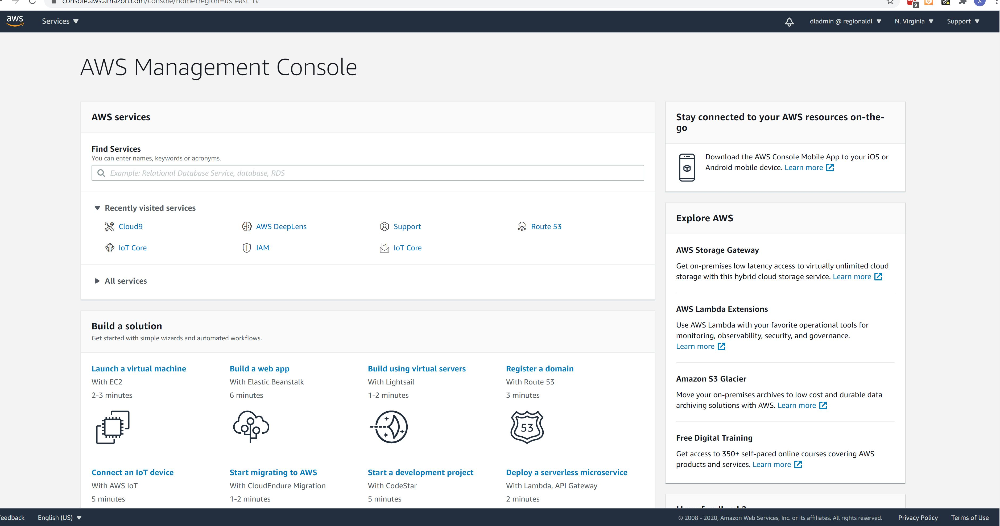

# Hosting a Static Website on AWS

## Welcome builders! 

In this session we will be making our own static website on AWS. This website will not need servers to work, saving us money, time and effort which we can put into other interesting projects!

There are only a few components to this solution, which are:
* **Amazon S3** - This is the service that will host our web application files that make up our static site.
* **Amazon CloudFront** - This service will make our web application available on the internet.
* **Amazon Cloud 9** - This is the service we will use to edit our web application files. Cloud 9 is similar to applications like Visual Studio and Ecplise, except it's consumed via a web browser.

For this workshop, we will be using *us-east-1* as our AWS Region.

## Step 1, Let's Sign In to AWS
Signing into the AWS Console is easy, but changes depending if you are working individually or if you are attending an AWS Event. If you are attending an event, your instructor likely gave you access to the Event Engine. 
Please follow the instructions that are applicable for your personal circumstances today.

  
I am using AWS Event Engine

  
  ### Accessing the console via Event Engine
  
  

  
I am using my own AWS Account

  
  ### Accessing the console using my own account
  
  

## Step 2, A Quick Tour of the AWS Console
Before we begin it's important that we orient ourselves with the AWS Console. So we have an easier time getting about later.

When you first log into the AWS Console, you will see the AWS Console Home Screen. For now we are just going to focus on the top navigation menu, as there are a few important components here we will take a look at.

#### AWS Navigation Menu

 
 ##### AWS Logo
 You can click this at any time to return to the AWS Console Home screen. This can be a useful place to go if you get lost and need to orientate yourself.
 
 ##### Services Drop down menu 
 The services drop down menu is how you easily navigate around the AWS Console. If you click this drop down menu, you will see that the panel on the left saves your recently visited AWS Services (making it easier to go back to where you were).
 
 At the top there is a **Unified Search Bar** which enables you to easiy find AWS Services to visit, as well as related documentation and training. Think of this as a built in search engine that helps you find your way around and makes it easier to find the content you're looking for.
 
 Below the Unified Search Bar, you can see an organised index of AWS Services, categorised by technology domain.
 
 During this workshop we will ask you to visit a few different AWS Services, this menu is how you can access them.
 
 ##### "The Bell"
 
 This drop down menu helps you quickly see the overall AWS Service health, and enables you to view more about any alerts or issues that may need your attention.
 
 ##### Your User Name
 
 This drop down menu enables you to access options that relate to your user account and your AWS Account and Organisation. You can find billing information from this menu, as well as view and update your account details as they change over time.
 
 ##### The AWS Region Drop Down
 
 This is a very important part of the AWS Console. It shows you what AWS Region globally you're currently interacting with. If you click on this drop down, you will be presented with the different AWS Regions available to you. This list changes as you move throughout the AWS Console, as not all Regions have the same AWS Services, so we will only show you the AWS Regions that are available for whatever AWS Service you are currently working with.
 
 Remember for this workshop today, we are going to be working in the **US East - N'Virginia (us-east-1)** Region. Please make sure this region is selected now to save any headaches later.
 
 ##### Support Drop Down
 
 This is where you can access help and support with your AWS adventures. You can also access documentation, AWS Forums and technical guidance in this menu. 

## Step 2, Launch our Cloud 9 Instance
We are going to use the AWS Console to create a Cloud 9 instance. This Cloud 9 instance will enable us to make code changes and interact with AWS via the CLI without having to install and configure our local computers to interact with AWS... Very Nice!

1. Click the AWS Service Drop Down menu, and in the Unified Search Box search for *Cloud 9* and click the link to open the AWS Cloud 9 Dashboard.
2. Click the orange *Create Environment* button
3. Let's give your environment a meaningful name. Seeing as my name is **Xavier** I will call mine *"Xavier's Environment"*, feel free to name yours as you wish.
4. Entering a description is optional, so let's click **Next Step**
5. Now we need to configure the settings for our Cloud 9 instance, let's leave the option **Environment Type** as the default option *Create a new EC2 instance for environment (direct access)*
6. For **Instance Type**, we will leave the configuration as *t2.micro (1 GiB RAM + 1 vCPU)*, as this is just a simple development server, we don't need a large instance. 
7. We wll also leave the default option for **Platform** as *Amazon Linux 2 (Recommended)*
8. For **Cost-saving setting** we will yet again leave the setting as the default option of *After 30 Minutes*.
9. Leave everything as is, and click the orange **Next Step** button.
10. You will now be presented with a **Review** screen to confirm your settings and configuration, give this a quick once over, and then click the orange **Create Environment** button to begin launching your Cloud 9 Instance.
11. Within less than 2 minutes you should be looking at your new Cloud 9 Development Environment.

## Step 3, Our first look around Cloud 9

On the left, you can see the Project files pane. Much like other IDEs you may have used, this is where you can visually navigate your project files. You can also click and drag files and also right click and copy and paste files around, just like you do in Windows and MacOS. This should feel pretty comfy.

In the centre this is where your code editors will pop up. At the moment you will see a Cloud 9 Welcome screen. Feel free to read through what is says, you may find some of it interesting. When you are done, you can safely close this tab and continue on.

On the right hand side of the Cloud 9 IDE, you can see the collapsed menus / icons. You may also recognise these icons as AWS Services. We won't need these for now, but they are integrations to the greater AWS ecosystem. Good to know where they are, but we can carry on for now.

In the lower pane we can see the terminal window. This is just like a terminal in MacOS or Linux and will accept nearly all the same commands and logic you are used to. If you are mainly a Windows user, you may find this cheat sheet here helpful in the future, however for today don't worry, these instructions are detailed enough for you to safely continue.

## Step 4, Working with S3 from the command line. 

One of the first things we need to do is create our Amazon S3 Bucket. This S3 Bucket will hold our static site files as S3 Objects. S3 emulates the experience of a usual file system and so you should feel fairly comfortable working your way through S3.

Let's begin by creating an S3 bucket for our website files, and this begins by choosing a name. S3 Bucket names need to be globally unique, and once a name is taken it's gone for as long as that S3 Bucket exists! So, to save some time I am going to give my S3 bucket a unique name of "xaviers-website-2020-12-04". You're free to enter whatever you like, keeping in mind you may need to retry if you pick a name that is already in use.

Once, you have selected your bucket name, you can create it with the following command:

`aws s3 `

*If you like you can read more about this AWS CLI command for Creating an S3 Bucket by [Clicking Here](https://docs.aws.amazon.com/cli/latest/reference/s3api/create-bucket.html)*

If your bucket created successfully you should see something like the below:

If you see something like the below, it means you're attempting to give your new S3 bucket a name that has already been taken. Just try the command again with a different name for your S3 bucket.

Make a note of your new S3 Bucket name, we will need to refer to it again soon!

## Step 5, Create some site files

Let's Create our web application files now. We are just going to be creating a simple application today, but everything we are doing will translate to a larger static web application that you wish to host too.

Right click the root folder in the project files pane and select new folder

Name this folder `website-files`

Next, right click this new folder and select New File, and then give the new file the name `index.html` as it will be the default page for our website.

Next open `index.html` by double clicking it, and paste the below code into the code editor:

    <html>
        <head>
            <title>Hello World</title>
        </head>
        <body>
            <marquee>Hello World, welcome to my page!</marquee>
        </body>
    </html>

This code will be our super simple web page for now. It won't win any awards but it's a great place to start.

## Step 6, Upload files to Amazon S3

Now we need to upload this code to our S3 bucket. To do this we can issue a very simple command that will sync the contents of one folder to an S3 Bucket. This command is called **S3 Sync**, and you can read more about it [here](#) if you want to learn more.

Using the CLI pane, make sure you're in the same folder as your `index.html` file by running this command:

`cd ~/environment/website-files`

To confirm you are in the right location you can run the following command to list the files in the current folder:`
`
`ls`

You should see something like this:

    dladmin:~/environment $ cd ~/environment/website-files/
    dladmin:~/environment/website-files $ ls
    index.html
    dladmin:~/environment/website-files $ 

If you can see `ìndex.html` in the results, that means you're in the right location.

Then, issue the following command to begin syncing your current folder to your S3 Bucket, be careful to ensure you replace `<s3 bucket name` with the name of the S3 Bucket you created earlier:

`aws s3 sync . s3://<s3 bucket name>`

You should see results similar to this:

    dladmin:~/environment/website-files $ aws s3 sync . s3://xaviers-website-2020-12-04
    upload: ./index.html to s3://xaviers-website-2020-12-04/index.html
    dladmin:~/environment/website-files $ 

If so, you have successfully uploaded your files to Amazon S3, congrats!

## Step 7, Setup Amazon CloudFront

Amazon CloudFront is a fast content delivery network (CDN) service that securely delivers data, videos, applications, and APIs to customers globally with low latency, high transfer speeds, all within a developer-friendly environment. Today we will be using CloudFront to serve the files for our website that are stored in our S3 Bucket we created and sync'd to earlier.

Whilst we could create our *CloudFront Distribution* from the CLI like we did with our S3 Bucket, it's time we earned some expeirence working with the AWS Console. So, go ahead and click on the *Services* drop down menu in the top left hand side of the screen, search for `cloudfront` and click it in the list to go to the AWS CloudFront console.

Let's begin creating our first CloudFront Distribution.

1. Click the blue button labled **Create Distribution**
2. Click the blue button labled **Get Started** under the *Web* section
*You're going to see a lot of options on this screen, we will address each one in order so you can easily follow along. A lot of these options **will not** need changing.*
3. Enter the following settings for the **Origin Settings** section.
    1. When you click in the textbox for **Origin Domain Name** you should see your S3 Bucket in the list, select your S3 Bucket by clicking on it.
    2. We can leave **Origin Path** blank
    3. Leave **Enable Origin Shield** set to *No*
    4. The value for **Origin ID** has been pre-filled for you, so leave this as-is.
    5. Change **Restrict Bucket Access** to *Yes*, this will also make a couple new options appear below.
    6. For **Origin Access Identity**, leave this as *Create a new Identity*
    7. Leave the **Comment** textbox with the values it already has.
    8. Change the option fro **Grant Read Permissions on Bucket** to *Yes, Update Bucket Policy*
    9. Leave **Origin Connection Attempts** as the value *3*
    10. Leave **Origin Connection Timeout** as the value **
    11. You can skip the **Origin Custom Headers** leaving the textboxes empty.
4. Enter the following settings for the **Default Cache Behavior Settings** section.
    1. For the option **Path Pattern** you cannot change this value, so continue on.
    2. For the option **Viewer Protocol Policy** change this value to *Redirect HTTP to HTTPS*
    3. Leave the option **Allowed HTTP Methods** at the default setting of *GET,HEAD*
    4. Skip the option **Field-level Encryption Config** leaving this value blank
    5. There are no options for **Cached HTTP Methods** so continue on
    6. Leave the option **Cache and origin request settings** at the default setting of *Use a cache policy and origin request policy*
    7. Skip the options for **Cache Policy**
    8. Skip the options for **Origin Request Policy**
    9. Leave the option **Smooth Streaming** at the default setting of *No*
    10. Leave the option **Restrict Viewer Access (Use Signed URLs or Signed Cookies)** at the default value of *No*
    11. Leave the option **Compress Objects Automatically** at the default value of *No*
    12. Skip the options for **Lambda Function Associations**
    13. Leave the option **Enable Real-time Logs** at the default value of *No*
5. Enter the following settings for the **Distribution Settings** section.
    1. Leave the option **Price Class** set to the default value of *Use All Edge Locations (Best Performance)*
    2. Leave the option **AWS WAF Web ACL** set to the default value of *None*
    3. Skip the option **Alternate Domain Names (CNAMEs)** leaving the textbox blank.
    4. Leave the option **SSL Certificate** set to the default value *Default CloudFront Certificate( **.cloudfront.net)*
    5. Leave the option **Supported HTTP Versions** set to the default value of *HTTP/2, HTTP/1.1, HTTP/1.0*
    6. Change the value for the option **Default Root Object** in the textbox to the value *index.html*
    7. Leave the option **Standard Logging** set to the default value *Off*
    8. Skip the option **S3 Bucket for Logs** as it is disabled
    9. Skip the option **Log Prefix** as it is disabled
    10. Skip the option **Cookie Logging** as it is disabled
    11. Leave the option **Enable IPv6** set to the default value *ticked*
    12. The option **Comment** is optional, you can skip this if you like
    13. Leave the option **Distribution State** set to the default value *Enabled*
6. Click the blue button labled **Create Distribution** to create your new CloudFront Distribution.
7. On the left hand side of the window there is a navigation menu, select the top option **Distributions** to see all the CloudFront distributions in your account.
8. If you look at the **Status** of your new CloudFront Distribution, it will have the status of *In Progress*, it may take up to 10 minutes for this status to change. Just be patient for now.
9. When your CloudFront Distribution has the status *Deployed*, you will see that there will be a domain name in the **Domain Name** column ending with *.cloudfront.net*, this is the domain name for your new website.
10. Copy this domain name, open a new tab in your web browser and navigate to the domain name you copied.
11. You should now see your website, live on the internet. Nice work!

## Step 8, Let's publish some changes.

Naturally we will want to make changes to our web application over time, and it's really easy to push these changes up to Amazon S3 again, we just run the same `aws sync` command again. Except we also need to manage the CloudFront Distribution cache. After we make changes and upload them you will not see your changes live. This is because CloudFront has cached your content. This will happen naturally *eventually* as the cache expiry lapses but we are in a hurry, so we will need to issue a *Cache Invalidation* to tell CloudFront to delete the cache and return to the origin (your S3 Bucket).

Let's make some changes.

1. Open your index.html file and replace the contents of the file with the below code.

     <html>
        <head>
            <title>Hello World</title>
        </head>
        <body>
            <marquee>Hello World, welcome to my page!</marquee>
            
        </body>
    </html>

2. Save index.html
3. Right click the folder `website-files`in the project files pane on the left and select **New Folder**
4. Give this new folder the name **images** being careful to ensure the name is in lower case
5. Download this image and save it to your computer somewhere: [Download This Image](#https://d32hgu7z3a2lwb.cloudfront.net/images/smile.jpg)
6. Click the newly created folder **images** ensuring that it is highlighted, then at the top of the Cloud 9 IDE click **File** -> **Upload Files**
7. Select the image file you just downloaded to your computer and upload that into the **images** folder.
8. Next, enter the following command into the **terminal pane** at the bottom of the screen to ensure your at the root of your project.

`cd ~/environment/website-files` 

9. Issue the **s3 sync** command by running the following command in the terminal pane.

`aws s3 sync . s3://<s3 bucket name>`

10. Your updates should now be uploaded to your Amazon S3 bucket.
11. Now check the domain CloudFront created for you, your content should still be the *old version*, this is because we still need to *Invalidate the cache*
12. Open the CloudFront console and click the **Distribution Id* of your CloudFront Distribution to open the details of your distribution.
13. Click the **Invalidation* tab to open cache invalidation options
14. Click the blue button labled *Create Invalidation*
15. In the textbox within the popup window, enter a single asterisk character '*' to invalidate all items cached.
16. Click the blue button labled **Invalidate** to begin the cache invalidation.
17. After a few seconds, refresh your web page and you will see your new content details.

